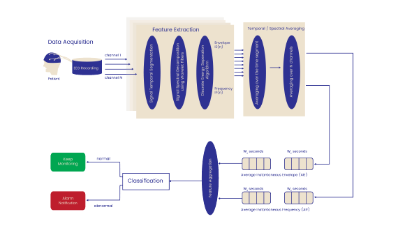

# Patient-Aware Adaptive N-Gram Algorithm for Epileptic Seizure Prediction

## Overview
This repository implements a patient-aware adaptive n-gram feature-extraction approach for seizure prediction from EEG. The algorithm counts amplitude patterns of predefined lengths within time windows, computes an anomalies ratio (AR), and classifies pre-ictal vs. inter-ictal segments with a Random Forest classifier. The implementation follows the workflow described in the IEEE Healthcom 2016 paper “Patient-aware adaptive n-gram based algorithm for epileptic seizure prediction using EEG signals” by Alawieh et al.


## Methodology
1. Segmentation: select pre-ictal and inter-ictal windows for each patient.
2. N-gram feature extraction: count occurrences of amplitude patterns (pattern lengths PL) within sub-intervals of a window; compute the anomalies ratio (AR) per sub-interval.
3. Patient-aware parameters: tune WS (window size), L (interval length), PL (pattern lengths), Offset (grace period), CT (count threshold), and Weight (downsampling) per patient.
4. Classification: feed AR vectors to a Random Forest model for binary classification.
5. Evaluation: iterate through seizure/non-seizure pairs with leave-one-pair-out cross-validation; report Accuracy, Sensitivity, and False Alarm Rate (FAR).

## Repository Structure
```
.
├── figures/
│   └── ngram_pipeline.png
└── README.md
```

Optional folders you may add:
```
src/           # core Python modules for feature extraction and training
notebooks/     # Jupyter notebooks reproducing experiments
data/          # dataset access scripts or loaders (no raw data in repo)
```

## Installation
```bash
# clone your repo, then within the project root:
python -m venv venv
# Linux/MacOS
source venv/bin/activate
# Windows
# venv\Scripts\activate

pip install -r requirements.txt
```

## Usage (sketch)
```python
# Example interface if modularized
from src.ngram_features import extract_ngram_features
from sklearn.ensemble import RandomForestClassifier

AR_matrix, labels = extract_ngram_features(
    signals,            # dict or ndarray [channels x samples]
    fs=256,             # sampling rate
    WS=10*60,           # window size in seconds
    L=30,               # interval length in seconds
    PL=[11, 9, 7, 5],   # pattern lengths (samples)
    offset=3*60,        # seconds before onset excluded from pre-ictal
    CT=2,               # count threshold
    weight=1            # downsampling factor
)

clf = RandomForestClassifier()
clf.fit(AR_matrix["train"], labels["train"])
pred = clf.predict(AR_matrix["test"])
```

## Parameters
- WS: window size before seizure (1–20 minutes typical)
- L: interval length (10–60 seconds)
- PL: pattern lengths in samples (e.g., [11, 9, 7, 5])
- Offset: minutes excluded before onset (0–9)
- CT: count threshold for significant patterns
- Weight: downsampling factor for efficiency

## Evaluation Protocol
- Build N pairs per patient (pre-ictal, inter-ictal).
- Train on N−1 pairs and test on the held-out pair; loop over all pairs.
- Compute metrics:
  - Accuracy = (TP + TN) / (TP + TN + FP + FN)
  - Sensitivity = TP / (TP + FN)
  - FAR = FP / (FP + TN)

## Notes
- Use identical y-axis scaling when visually comparing raw pre-ictal vs. inter-ictal segments to avoid misleading amplitude compression.
- Channel selection can be patient-specific (use channels that exhibit seizure activity).

## Reference
H. Alawieh, H. Hammoud, M. Haidar, M. H. Nassralla, A. M. El-Hajj, Z. Dawy, “Patient-aware adaptive n-gram based algorithm for epileptic seizure prediction using EEG signals,” IEEE Healthcom, 2016.


---

# Patient-Aware EEG-Based Feature and Classifier Selection

## Overview
This section implements and documents a second patient-aware seizure prediction approach, based on the paper:
*"Patient-Aware EEG-Based Feature and Classifier Selection for e-Health Epileptic Seizure Prediction"*【56†source】.

The approach integrates **optimized spatio-temporal feature extraction** with **classifier selection** to maximize accuracy and minimize false alarms.



## Methodology
1. **Wavelet decomposition:** EEG signals are decomposed into multiple resolution levels using discrete wavelet transform (DWT).  
2. **DESA feature extraction:** At each level, the Discrete Energy Separation Algorithm (DESA) computes instantaneous envelope and frequency.  
3. **Temporal and spatial averaging:** Features are averaged across time and channels to produce stable feature vectors.  
4. **Feature aggregation:** Concatenate averaged envelope/frequency features across epochs.  
5. **Classifier selection:** A patient-specific choice among Random Forest, Logistic Classifier, Support Vector Machines (SVM), or Gaussian Classifier is made depending on performance.  
6. **Decision making:** The algorithm applies thresholding over consecutive pre-ictal intervals to decide whether a seizure alarm should be raised.

## Key Insights
- Patient-specific optimization of both **features** and **classifier** significantly improves accuracy.  
- Reported performance: average sensitivity above 95% and false alarm rate below 5% on Freiburg database patients【56†source】.  
- Classifier selection is essential as patients’ EEG dynamics differ, requiring tailored models.

## Reference
M. Nassralla, M. Haidar, H. Alawieh, A. El Hajj, Z. Dawy,  
*“Patient-aware EEG-Based Feature and Classifier Selection for e-Health Epileptic Seizure Prediction”*,  
2018 IEEE e-Health Networking, Applications and Services (Healthcom).【56†source】
