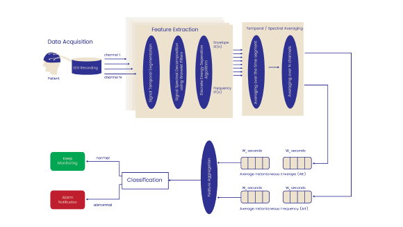

---

# Patient-Aware EEG-Based Feature and Classifier Selection

## Overview
This section implements and documents a second patient-aware seizure prediction approach, based on the paper:
*"Patient-Aware EEG-Based Feature and Classifier Selection for e-Health Epileptic Seizure Prediction"*【56†source】.

The approach integrates **optimized spatio-temporal feature extraction** with **classifier selection** to maximize accuracy and minimize false alarms.

## Methodology
1. **Wavelet decomposition:** EEG signals are decomposed into multiple resolution levels using discrete wavelet transform (DWT).  
2. **DESA feature extraction:** At each level, the Discrete Energy Separation Algorithm (DESA) computes instantaneous envelope and frequency.  
3. **Temporal and spatial averaging:** Features are averaged across time and channels to produce stable feature vectors.  
4. **Feature aggregation:** Concatenate averaged envelope/frequency features across epochs.  
5. **Classifier selection:** A patient-specific choice among Random Forest, Logistic Classifier, Support Vector Machines (SVM), or Gaussian Classifier is made depending on performance.  
6. **Decision making:** The algorithm applies thresholding over consecutive pre-ictal intervals to decide whether a seizure alarm should be raised.

## Key Insights
- Patient-specific optimization of both **features** and **classifier** significantly improves accuracy.  
- Reported performance: average sensitivity above 95% and false alarm rate below 5% on Freiburg database patients【56†source】.  
- Classifier selection is essential as patients’ EEG dynamics differ, requiring tailored models.

## Reference
M. Nassralla, M. Haidar, H. Alawieh, A. El Hajj, Z. Dawy,  
*“Patient-aware EEG-Based Feature and Classifier Selection for e-Health Epileptic Seizure Prediction”*,  
2018 IEEE e-Health Networking, Applications and Services (Healthcom).【56†source】
